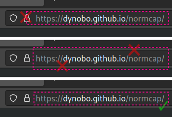

---
hide:
  - navigation
---

# FAQs

## General

<details class="question" markdown>
<summary>How can I improve the detection accuracy?</summary>

### How can I improve the detection accuracy?

The quality of detections is mainly determined by
[Tesseract](https://tesseract-ocr.github.io), an open source project for OCR of
_printed_ text. NormCap builds upon this great library and can influence the quality
only a bit by preprocessing the images regarding screen specific properties. _You_, the
user, have much more influence on the quality by paying attention to certain aspects:

#### 1) Select the correct language

Make sure to select the appropriate language(s) in the settings. Selecting multiple languages might slow down the recognition.

#### 2) Avoid selecting decorations

The text detection is very sensible to elements
_other_ than text, for example borders, lines or icons. If possible, do not select
those:



#### 3) Avoid heterogeneous colors

If the text you want to recognize has different
backgrounds, it can help to select those portions of text
separately:


#### 4) Zoom in

If possible, enlarge the region you want to detect, before selecting it
with NormCap. This has a huge effect in situations, where zooming in doesn't
decrease the quality, e.g. zooming into webpages, PDF documents or images which are
not yet at their full resolution. It has little effect, if enlarging decreases the
quality, e.g. for images with low resolutions.

#### 5) Select more text

Sometimes Tesseract struggles with recognizing text with only
very few characters, like a single word. In this case, selecting a larger portion
of text can improve the accuracy.

#### 6) Try different language models

The prebuilt NormCap packages are using
[tessdata-fast](https://github.com/tesseract-ocr/tessdata_fast) models, which offer
a very good accuracy to speed compromise. But you can also try the slower and
larger models from [tessdata](https://github.com/tesseract-ocr/tessdata) or
[tessdata-best](https://github.com/tesseract-ocr/tessdata_best) instead.\
To find
the directory in which you have to put the manually downloaded models navigate to
the "Language" section of NormCap's settings, then click "add/remove" and finally
"View tessdata folder in File Manager".

#### 7) Report examples

If the results are still bad, please submit a screenshot of the
text you are trying to recognize
[as an issue](https://github.com/dynobo/normcap/issues). Chances are small, but we
might be able to improve something.

</details>

<details class="question" markdown>
<summary>How can I start NormCap via command line interface?</summary>

### How can I start NormCap via command line interface?

The command to run NormCap from the terminal/console depends on your operating system
and installation method:

- **On Windows (MSI):** `%LOCALAPPDATA%\Programs\NormCap\NormCap.exe`
- **On macOS (DMG):** `/Applications/NormCap.app/Contents/MacOS/NormCap`
- **On Linux (AppImage):** `./NormCap-{version}-x86_64.AppImage`
- **On Linux (FlatPak):** `flatpak run --command=normcap com.github.dynobo.normcap`
- **On Linux (AUR):** `normcap`
- **Installed as Python package:** `normcap`

NormCap has some useful command line feature, you can list them by appending the flag
`--help` to the command mentioned above.

</details>

<details class="question" markdown>
<summary>How can I start NormCap via a keyboard shortcut?</summary>

### How can I start NormCap via a keyboard shortcut?

You'll have to configure that using your operating system's functionality, e.g.
following these guides:

#### :material-microsoft-windows: Windows

- Native solution: [Open programs with keyboard shortcuts in Windows 10](https://www.cnet.com/tech/computing/open-programs-with-keyboard-shortcuts-in-windows-10/)
- Tool based: [Run programs via shortcut](https://www.autohotkey.com/docs/v1/Tutorial.htm#s4) with [AutoHotkey](https://www.autohotkey.com/)

#### :material-apple: macOS

- [Set a keyboard shortcut to open Mac apps](https://www.wikihow.com/Set-a-Keyboard-Shortcut-to-Open-Mac-Apps)

#### :material-linux: Linux

- Ubuntu/Gnome:
  [Set Keyboard Shortcuts](https://help.ubuntu.com/stable/ubuntu-help/keyboard-shortcuts-set.html)
- Manjaro/Xfce, Plasma:
  [Keyboard Shortcuts](https://wiki.manjaro.org/index.php?title=Keyboard_Shortcuts)

To identify the command to run NormCap, please see the FAQ
"[How can I start NormCap via command line interface?](#how-can-i-start-normcap-via-command-line-interface)"

!!! Info
    The reason for _not_ adding an option to configure a shortcut within
    NormCap itself can be found in
    [this
    Architecture Decision Record](https://github.com/dynobo/normcap/blob/main/adr/004-do-not-implement-hotkey.md). If you have read the explanation and like to challenge its argumentation, feel free
    to [open a
    discussion](https://github.com/dynobo/normcap/discussions).

</details>

<details class="question" markdown>
<summary>How can I run NormCap automatically on system start?</summary>

### How can I run NormCap automatically on system start?

Use your operating system's functionality to autostart applications after boot. You will need [the command to start NormCap](#how-can-i-start-normcap-via-command-line-interface) and you can
search for tutorials how to run that on start-up, e.g.:

- Windows:
  [How to Add a Program to Startup in Windows 10 or 11](https://www.howtogeek.com/208224/how-to-add-a-program-to-startup-in-windows/)
- macOS:
  [How to add a startup program on a Mac](https://www.howtogeek.com/877239/how-to-change-startup-programs-on-a-mac/#how-to-add-a-startup-program-on-a-mac)
- Linux (Gnome):
  [Automatically run program on startup](https://www.simplified.guide/gnome/automatically-run-program-on-startup)
- Linux (KDE):
  [How to automatically run program on KDE startup](https://www.simplified.guide/kde/automatically-run-program-on-startup)

!!! warning
    Add the `--background-mode` flag to the
    command used to start NormCap! Then NormCap will start silently minimized to system tray without triggering a capture!

</details>

<details class="question" markdown>
<summary>How can I start NormCap in the background?</summary>

### How can I start NormCap in the background?

First [identify the command to run NormCap](#how-can-i-start-normcap-via-command-line-interface) on your system.

Append the flag `--background-mode` to that command to start NormCap right into the
system tray, without triggering a capture.

This is e.g. useful, if, you want to autostart NormCap after system start.

</details>

<details class="question" markdown>
<summary>How can I add additional languages to NormCap?</summary>

### How can I add additional languages to NormCap?

The prebuilt packages are shipped with support for English only. To install additional
languages, click the settings icon and in the "Languages" section of the menu click
"add/remove...".

If you installed NormCap as Python package, it depends on your system and setup. Please search online.

</details>

<details class="question" markdown>
<summary>Why is the Windows-Installer's file size so large?</summary>

### Why is the Windows-Installer's file size so large?

NormCap's MSI installer is much larger than the ones for Linux and macOS because the
included Tesseract binaries are larger.

NormCap used to include a set of smaller binaries, which resulted in more consistent
installer file sizes for all operating systems. Unfortunately, they seemed to lack some
dependencies and lead to issues on some Windows systems. Hopefully, the larger binaries
will fix this issue. This decision is not set in stone, so please feel free to leave
some feedback regarding this topic!

</details>

<details class="question" markdown>
<summary>Is any data send to the internet?</summary>

### Is any data send to the internet?

In general, NormCap works offline and does not send any data anywhere.

The only exceptions are optional features, which _require_ accessing resources on the internet. In that case, HTTPS request are performed and generate the typical access log data on the target server.

Those features are:

- **Update check**: If you enable the check for updates on start, NormCap regularly fetches its releases page from GitHub.
- **Manage languages**: If you download additional languages, they are being fetched from a GitHub repository.

</details>

<details class="question" markdown>
<summary>Are there alternatives to NormCap?</summary>

### Are there alternatives to NormCap?

Some applications offer similar features like NormCap and might be a good or even better
alternative for you: It completely depends on your use case and requirements. Some
similar open-source Projects are:

- [TextSnatcher](https://github.com/RajSolai/TextSnatcher) (Linux)
- [GreenShot](https://getgreenshot.org/) (Linux, macOS)
- [TextShot](https://github.com/ianzhao05/textshot) (Windows)
- [gImageReader](https://github.com/manisandro/gImageReader) (Linux, Windows)
- [Capture2Text](https://sourceforge.net/projects/capture2text) (Windows)
- [Frog](https://github.com/TenderOwl/Frog) (Linux)
- [Textinator](https://github.com/RhetTbull/textinator) (macOS)
- [Text-Grab](https://github.com/TheJoeFin/Text-Grab) (Windows)
- [dpScreenOCR](https://danpla.github.io/dpscreenocr/) (Linux, Windows)
- [PowerToys Text Extractor](https://learn.microsoft.com/en-us/windows/powertoys/text-extractor)
  (Windows)

</details>

## Troubleshooting

<details class="question" markdown>
<summary>How to get debug information?</summary>

### How to get debug information?

Launch NormCap via a terminal/console using
[the right command for your system](#how-can-i-start-normcap-via-command-line-interface),
to which you can append the flag `--verbosity debug` or short `-v debug`. This will
print additional information to the console, which can be useful to identify problems.

</details>

<details class="question" markdown>
<summary>NormCap is not starting</summary>

### NormCap is not starting

Please try to take a look at the
[debug information](#how-to-get-debug-information).
It might provide enough information for you to solve the issue for yourself. If it
doesn't help you, don't hesitate to [report](https://github.com/dynobo/normcap/issues)
your problem description together with debug information.

</details>

<details class="question" markdown>
<summary>[Windows] Upgrading NormCap failed</summary>

### \[Windows\] Upgrading NormCap failed

Did you run the msi-installer to upgrade from an older NormCap version, but the
installer stated an error or the NormCap can't be started anymore?

You did nothing wrong, this is the recommended way to upgrade NormCap. But in rare
cases, this does not work, because of incompatible changes in the installer between
certain versions.

In that case, please try to uninstall all existing NormCap versions from your system
before trying a clean installation. (In the process, your settings _might_ get reset,
and you _might_ have to re-download languages.)

If you still experience any problems after such a clean installation, please
[report that issue](https://github.com/dynobo/normcap/issues/new/choose).

</details>

<details class="question" markdown>
<summary>[Linux] Normcap does not show up in system tray</summary>

### \[Linux\] Normcap does not show up in system tray

Is your display environment Gnome Shell? Then you probably need to install a
[Gnome Shell extension](https://extensions.gnome.org/) to support showing applications
in the top bar, e.g.:

- [AppIndicator Support](https://extensions.gnome.org/extension/615/appindicator-support/)
- [Ubuntu AppIndicators](https://extensions.gnome.org/extension/1301/ubuntu-appindicators/)
- [Tray Icons](https://extensions.gnome.org/extension/1503/tray-icons/)
- [Tray Icons: Reloaded](https://extensions.gnome.org/extension/2890/tray-icons-reloaded/)

</details>

<details class="question" markdown>
<summary>[Linux] NormCap doesn't show a notification after capture</summary>

### \[Linux\] NormCap doesn't show a notification after capture

NormCap's notifications depend on the system tray functionality. If you start NormCap,
but its Icon doesn't appear in the system tray, proceed like in the question above.

</details>

<details class="question" markdown>
<summary>[Linux] Error: Could not load the Qt platform plugin</summary>

### \[Linux\] Error: Could not load the Qt platform plugin

In case you get an output like this...

```
$ normcap
QtFatalMsg - This application failed to start because no Qt platform plugin
could be initialized. Reinstalling the application may fix this problem.
Available platform plugins are: eglfs, linuxfb, minimal, minimalegl, offscreen,
vnc, wayland-egl, wayland, wayland-xcomposite-egl, wayland-xcomposite-glx, webgl, xcb.
```

... the chances are, this can be solved by installing additional dependencies:

- Arch (Wayland): `pacman -S qt6-wayland`
- Arch (Xorg): `pacman -S libxcb xcb-util-cursor`
- Debian/Ubuntu (Wayland): `apt install qt6-wayland`
- Debian/Ubuntu (Xorg): `apt install libxcb1 libxcb-cursor0`
- Fedora (Wayland): `dnf install qt6-qtwayland`
- Fedora (Xorg): `dnf install libxcb xcb-util-cursor`

</details>

<details class="question" markdown>
<summary>[Linux] NormCap doesn't copy the results to clipboard when launched via shortcut</summary>

### \[Linux\] NormCap doesn't copy the results to clipboard when launched via shortcut

This is behavior
[was observed only on KDE + Wayland (#422)](https://github.com/dynobo/normcap/issues/422)
so far, and only when NormCap was started via a keyboard shortcut / key binding. The
root cause is still unknown, if you have any information or ideas, please comment in the
ticket above.

Strangely, a workaround seems to be to configure the keyboard shortcut via "System
Settings" → "Shortcuts" → "Add command" and configure the command in a way, that it
pipes the output to somewhere, e.g. /dev/null:

```
normcap 2>&1 | tee /dev/null
```

</details>

<details class="question" markdown>
<summary>[Linux, AppImage] Error: AppImages require FUSE to run</summary>

### \[Linux, AppImage\] Error: AppImages require FUSE to run

This is not a NormCap issue but a requirement for AppImages. You need to make sure, that
the `FUSE` library is installed on your system. E.g. on Ubuntu 22.04 you need to run
`sudo apt install libfuse2`.

See
[this blog post for details](https://techpiezo.com/linux/error-appimages-require-fuse-to-run-in-ubuntu-22-04/).

</details>

<details class="question" markdown>
<summary>[Linux, AppImage] Error while loading shared libraries: libcrypt.so.1</summary>

### \[Linux, AppImage\] Error while loading shared libraries: libcrypt.so.1

The
[application used to package the AppImage](https://gregoryszorc.com/docs/python-build-standalone/main/running.html#runtime-requirements)
has a number of runtime requirements. One of those requirements is `libcrypt.so.1`,
which should be provided by most modern Linux distributions, as it is mandated as part
of the Linux Standard Base Core Specification. However, some distributions don't include
`libcrypt.so.1` as part of the base OS configuration. This can usually be fixed by
installing the `libxcrypt-compat` package.

</details>

<details class="question" markdown>
<summary>[macOS] When NormCap is started, an empty desktop shows up</summary>

### \[macOS\] When NormCap is started, an empty desktop shows up

This issue usually occurs on the after installing NormCap, either for the first time or
after an update.

This is a known issue related to macOS's permissions settings: If NormCap doesn't have
the system's permission to take a screenshot, an empty desktop will be
shown. Or to be precise: NormCap doesn't _know_ that it lacks permissions,
tries to take a screenshot nevertheless, which results in a screenshot of the empty
desktop.</small>

Steps to solve this:

1. Close NormCap, if it is running.
1. Navigate to "System Preferences" → "Security & Privacy" → "Privacy" → "Screen
   Recording" → "Click unlock".
1. Do you already see "NormCap" on the right side? If yes, "remove" \[–\] it.
   **Un-ticking the checkbox is not enough!**
1. Click "add" \[+\] → "Applications" → "NormCap".
1. Confirm that you see NormCap on the right side with a checkmark in front of it.
1. Start NormCap, it should work now.
1. You might need to repeat those steps after installing a new version of NormCap.

Hopefully, this cumbersome user experience can be improved in a future release.

</details>

## Development

<details class="question" markdown>
<summary>"No such file or directory" error when running 'briefcase build'</summary>

### "No such file or directory" error when running `briefcase build`

To verify, if this is the issue you are facing, run the docker image interactively and
try to run the `linuxdeploy-*.AppImage` file there:

```sh
$ docker run -it \
  --volume /home/<USER>/<PROJECT PATH>/normcap/linux:/app:z \
  --volume /home/<USER>/.briefcase:/home/brutus/.briefcase:z \
  --env VERSION=0.2.0 briefcase/eu.dynobo.normcap:py3.9 \
  /bin/bash
$ /home/brutus/.briefcase/tools/linuxdeploy-x86_64.AppImage
```

If that results in a `No such file or directory` error, according to
[this issue](https://github.com/AppImage/AppImageKit/issues/1027#issuecomment-641601097)
and [this one](https://github.com/AppImage/AppImageKit/issues/828) a workaround is to
correct the "magic" bytes of the AppImage. This worked for me:

```sh
sed '0,/AI\x02/{s|AI\x02|\x00\x00\x00|}' -i linuxdeploy-x86_64.AppImage
```

</details>
