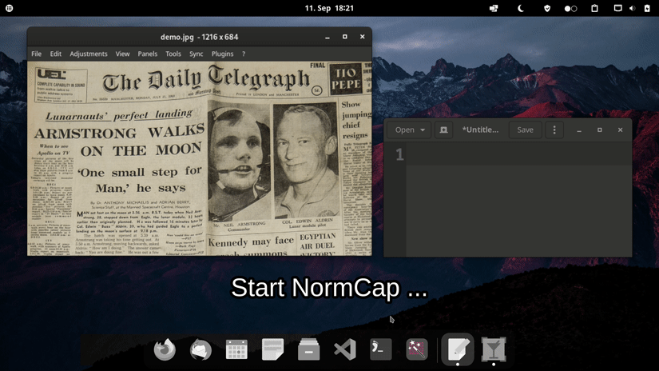

---
hide:
  - navigation
  - toc
---

# NormCap v0.5.8 {.md-title}

OCR-powered screenshot tool to capture text  instead of images.

Packages with the
[latest changes](https://github.com/dynobo/normcap/blob/main/CHANGELOG) for your system:

- [Download for **Windows**](https://github.com/dynobo/normcap/releases/download/v0.5.8/NormCap-0.5.8-x86_64-Windows.msi)
  <small>x86_64, ~120 MB</small>
- [Download for **Linux**](https://github.com/dynobo/normcap/releases/download/v0.5.8/NormCap-0.5.8-x86_64.AppImage)
  <small>x86_64, ~90 MB</small>
- [Download for **macOS**](https://github.com/dynobo/normcap/releases/download/v0.5.8/NormCap-0.5.8-x86_64-macOS.dmg)
  <small>x86_64, ~80 MB</small>
- [Download for **macOS (M1)**](https://github.com/dynobo/normcap/releases/download/v0.5.8/NormCap-0.5.8-arm64-macOS.dmg)
  <small>arm64, ~65 MB</small>

... or install via
[FlatHub](https://flathub.org/apps/details/com.github.dynobo.normcap),
[AUR](https://aur.archlinux.org/packages/normcap) or
[PyPi](https://pypi.org/project/normcap/).

[{ style=height:40px;opacity:0.9; }](https://www.buymeacoffee.com/dynobo)

## Features

:material-book-alphabet:{ .lg .middle } __Many Languages__

---

Use Tesseract's diverse [language models](https://tesseract-ocr.github.io/tessdoc/Data-Files) for text detection.

[:octicons-arrow-right-24: Add languages](faqs.md#how-can-i-add-additional-languages-to-normcap)

:material-incognito:{ .lg .middle } **Privacy First**

---

Detection is performed on your device and no telemetry data is collected.

[:octicons-arrow-right-24: Learn more](faqs.md#is-any-data-send-to-the-internet)

:material-format-font:{ .lg .middle } **Heuristic Parsing**

---

Mail addresses and URLs are detected and handled accordingly.

[:octicons-arrow-right-24: Learn more](usage.md#capture-modes)

:material-monitor-multiple:{ .lg .middle } **Multi Monitor Support**

---

Supports any number of displays with any scaling setting.

[:octicons-arrow-right-24: Learn more](usage.md#multi-monitor-support)

:material-desktop-classic:{ .lg .middle } **Cross Platform**

---

Available for Windows :material-microsoft-windows: & macOS :material-apple: & Linux :material-linux:.

[:octicons-arrow-right-24: Download](#)

:material-scale-balance:{ .lg .middle } **Free & Open Source**

---

NormCap is licensed under GPLv3 and available on [GitHub](https://github.com/dynobo/normcap/tree/main).

[:octicons-arrow-right-24: See license](https://github.com/dynobo/normcap/blob/main/LICENSE)

