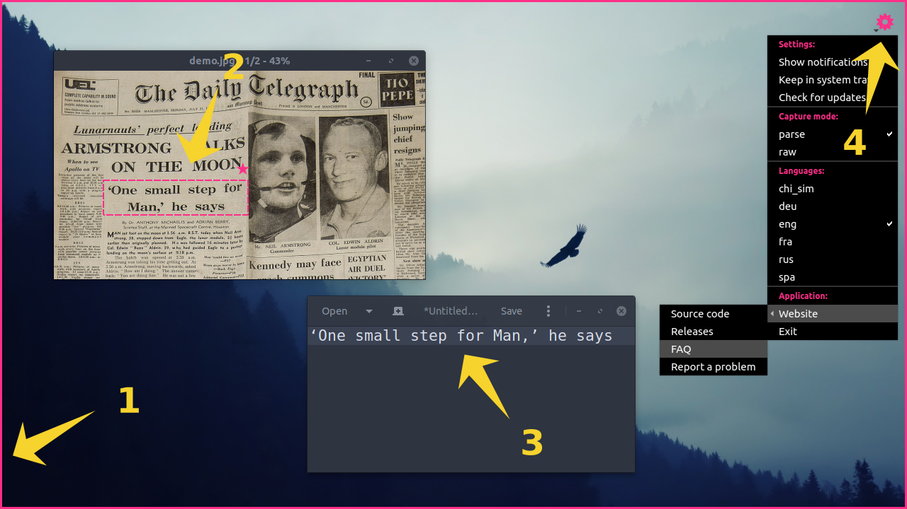

---
hide:
  - navigation
---

# Usage

A short guide for using NormCap and its most important features.

## Quickstart

1. Start NormCap and wait until a pink border appears.
1. Select a region on the screen with your mouse.  
   Then wait for a notification or a pink tray icon to appear to indicate, that the processing finished.
1. The detected text gets copied into your system clipboard, paste it into any application.
1. Use the menu ⚙ in the top right corner to adjust settings.

## Example use-cases

- Extract text from screenshots you received via mail.
- Copy error messages from non-selectable UI elements.
- Retrieve information from photos.
- Capture mail addresses from "crawler safe" images on the web.

## User Interface

- The settings can be accessed via the ⚙-icon in the top right.
- In the settings, you can adjust the language(s) you are trying to recognize, which is important for a good accuracy.
- The icons ★ or ☰ next to the selection-rectangle indicate the active "capture mode" (see below).
- To abort a capture or quit NormCap press `<esc>`

## Capture Modes

The settings menu ⚙ allows switching between the two capture modes: "parse" and "raw":

- **"Raw"-Mode**

    Marked by the ☰ symbol, it returns text just as detected by the OCR software. For example, all line-breaks are preserved.

- **"Parse"-Mode** <small>(default)</small>

    Indicated by the ★ symbol, it performs some formatting of the output based on certain implemented rules, which can take additional information like text position and content into account. In a first step, every rule calculates a "score" to determine the likelihood of being responsible for this type of text. In a second step, the rule which achieved the highest "score" takes the necessary actions to "transform" the input text according to its type. The following rules are currently implemented:

    **Heuristics performed in parse-mode:**

    | **Rule name**   | **Score heuristics**                                 | **Transform**                                                                        |
    | --------------- | ---------------------------------------------------- | ------------------------------------------------------------------------------------ |
    | **Single line** | Only single line is detected                         | Trim unnecessary whitespace                                                          |
    | **Multi line**  | Multiple lines, but single paragraph                 | Separate using line breaks and trim unnecessary whitespace in each line              |
    | **Paragraph**   | Multiple blocks of lines or multiple paragraphs      | Join every paragraph into a single line, separate different paragraphs by empty line |
    | **E-Mail**      | Number of chars in email addresses vs. overall chars | Transform to a comma-separated list of email addresses                               |
    | **URL**         | Number of chars in URLs vs. overall chars            | Transform to line-break separated URLs, discard all other characters.                |
